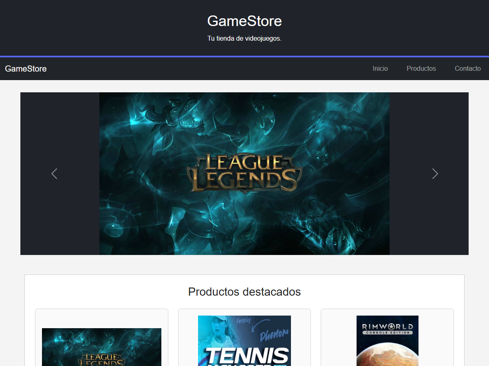
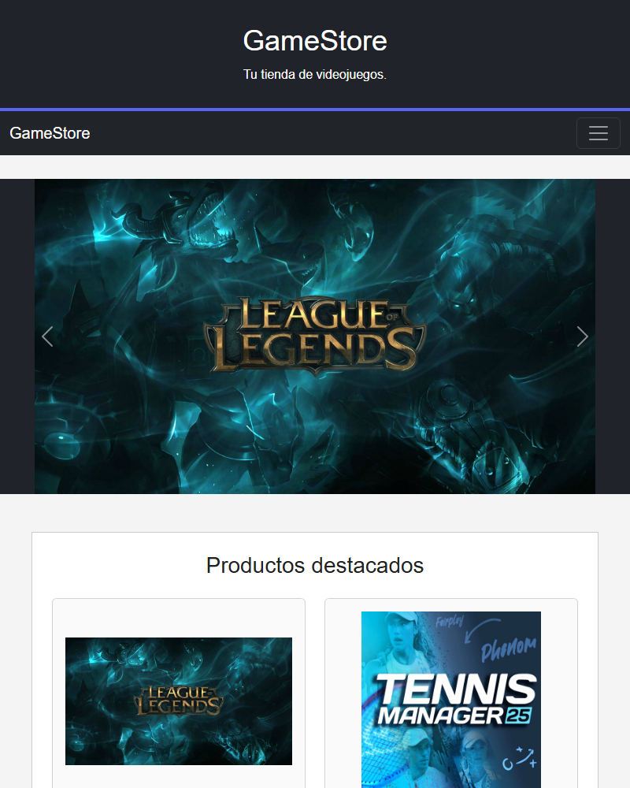
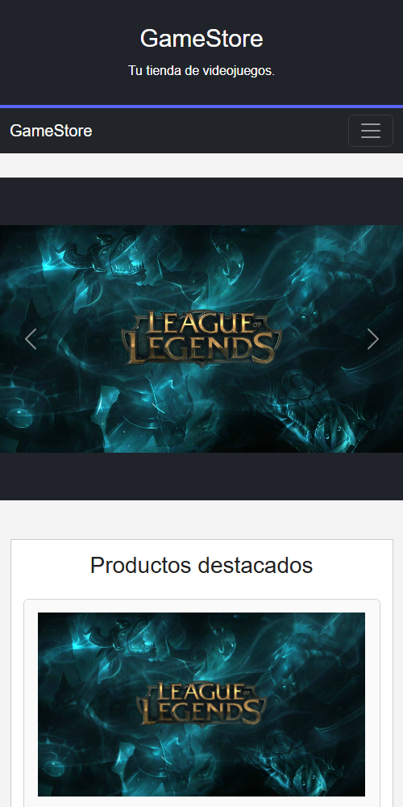

# GameStore

Sitio web responsivo para una tienda de videojuegos desarrollado como actividad de Desarrollo Frontend I.

## Tecnologias utilizadas

- HTML5
- CSS3
- Bootstrap 5

## Componentes Bootstrap

- Navbar responsiva y colapsable
- Carousel automatico cada 3 segundos
- Sistema Grid responsivo
- Cards para presentar los productos

## Diseño responsivo

La distribucion de las tarjetas utiliza el sistema Grid de Bootstrap:

- Movil: 1 tarjeta por fila (col-12)
- Tablet: 2 tarjetas por fila (col-md-6)
- Escritorio: 3 tarjetas por fila (col-lg-4)

## Productos

- League of Legends
- Tennis Manager 25
- RimWorld

## Sitio publicado

https://Marcelo-Rios21.github.io/HTML/

## Evidencias

### Escritorio

### Tablet

### Movil

