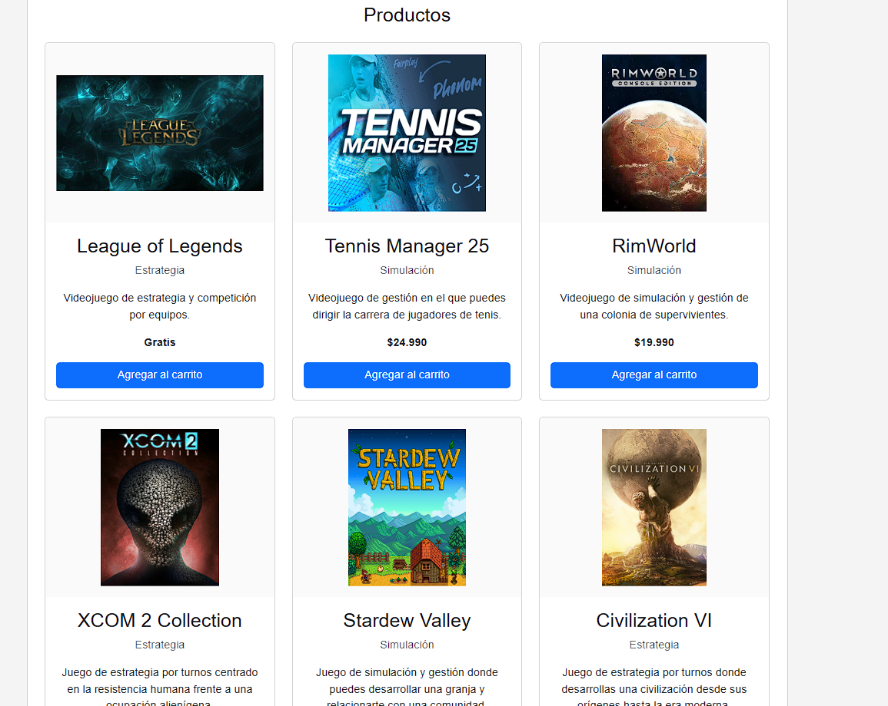
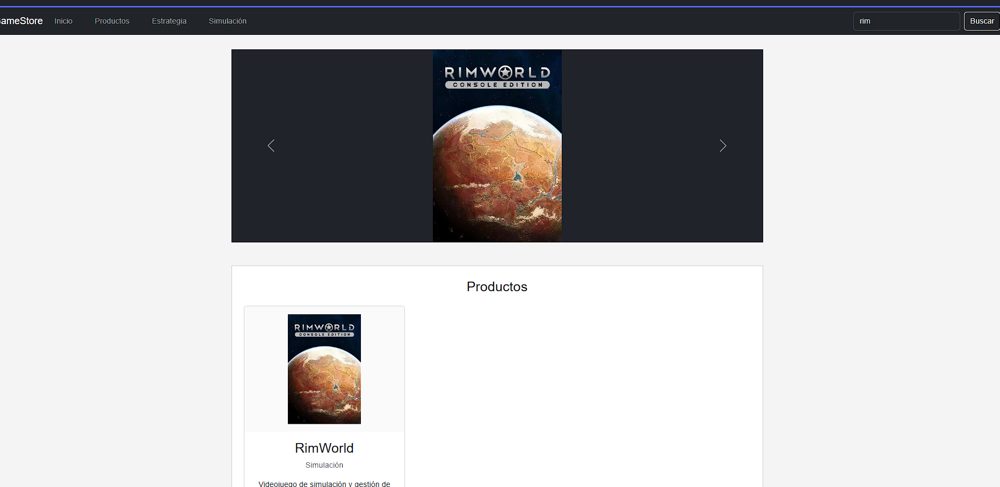
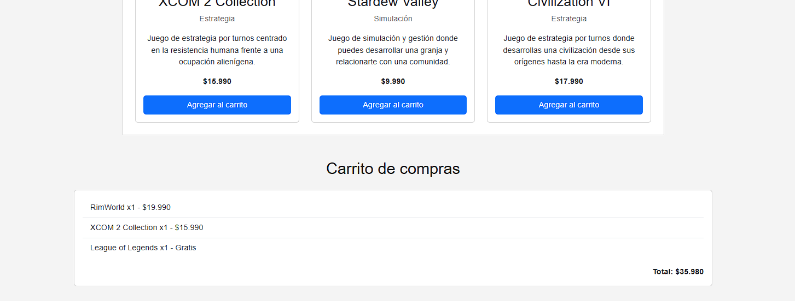
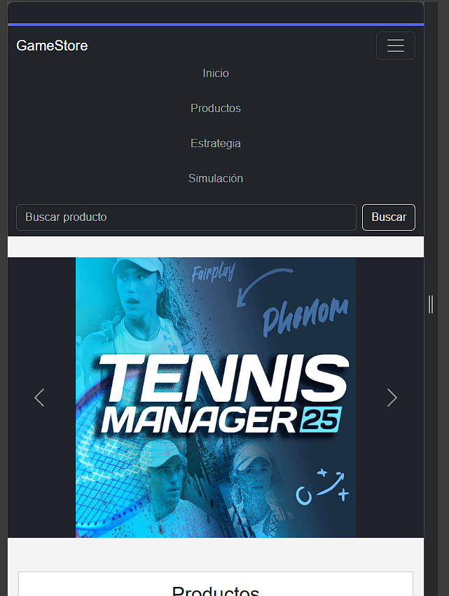

# GameStore

Sitio web responsivo para una tienda de videojuegos desarrollado como actividad de Desarrollo Frontend I.

## Tecnologías utilizadas

- HTML5
- CSS3
- Bootstrap 5
- JavaScript
- Fetch API
- JSON

## Componentes Bootstrap

- Navbar responsiva y colapsable con categorías simuladas
- Formulario de búsqueda integrado en la navegación
- Carousel automático cada 3 segundos
- Sistema Grid responsivo
- Cards para presentar productos

## Interactividad con JavaScript

El sitio incorpora manipulación del DOM y eventos mediante JavaScript:

- Creación dinámica de elementos con `createElement`
- Inserción de elementos con `appendChild`
- Evento `click` para agregar productos al carrito
- Eventos `click` para filtrar productos por categoría
- Evento `submit` para buscar productos sin recargar la página
- Evento `submit` para validar el formulario de contacto
- Actualización dinámica del resumen, cantidades y total del carrito
- Mensajes dinámicos para búsquedas sin resultados y errores de carga

## Fetch API

El catálogo de productos se carga desde:

`data/juegos.json`

JavaScript utiliza Fetch API para obtener los datos y generar dinámicamente las tarjetas de:

- League of Legends
- Tennis Manager 25
- RimWorld
- XCOM 2 Collection
- Stardew Valley
- Civilization VI

Cada producto incluye nombre, categoría, precio, imagen y descripción.

La carga incluye manejo de errores mediante `try/catch` y comprobación de la respuesta HTTP.

## Organización del JavaScript

El código está dividido en funciones con responsabilidades específicas:

- `formatearPrecio()`
- `crearTarjetaProducto()`
- `mostrarProductos()`
- `mostrarErrorCarga()`
- `agregarAlCarrito()`
- `mostrarCarrito()`
- `configurarFormulario()`
- `cargarProductos()`
- `configurarBusqueda()`
- `configurarCategorias()`

## Sitio publicado

https://Marcelo-Rios21.github.io/HTML/

## Evidencias de la versión actual

### Catálogo de productos

### Búsqueda de productos

### Carrito de compras

### Diseño responsivo

### Validación del formulario de contacto

