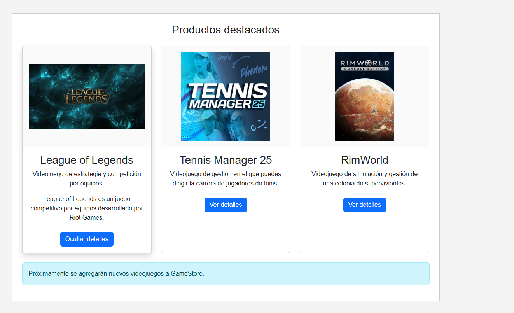
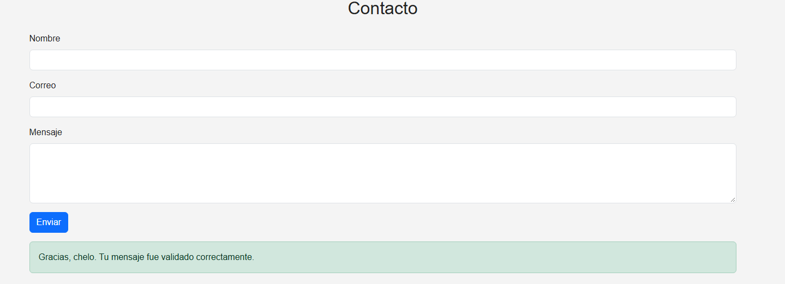
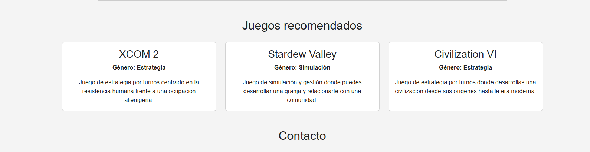

# GameStore

Sitio web responsivo para una tienda de videojuegos desarrollado como actividad de Desarrollo Frontend I.

## Tecnologías utilizadas

- HTML5
- CSS3
- Bootstrap 5
- JavaScript
- Fetch API
- JSON

## Componentes Bootstrap

- Navbar responsiva y colapsable
- Carousel automático cada 3 segundos
- Sistema Grid responsivo
- Cards para presentar productos

## Interactividad con JavaScript

El sitio incorpora manipulación del DOM y eventos mediante JavaScript:

- Creación dinámica de elementos con `createElement`
- Inserción de elementos con `appendChild`
- Evento `click` para mostrar y ocultar detalles de productos
- Evento `mouseover` para resaltar tarjetas
- Evento `submit` para validar el formulario sin recargar la página
- Modificación dinámica de textos, clases y contenido

## Fetch API

Los juegos recomendados se cargan desde:

`data/juegos.json`

JavaScript utiliza Fetch API para obtener los datos y generar dinámicamente las tarjetas de:

- XCOM 2
- Stardew Valley
- Civilization VI

La carga incluye manejo de errores mediante `try/catch` y comprobación de la respuesta HTTP.

## Organización del JavaScript

El código está dividido en funciones con responsabilidades específicas:

- `crearMensajeDinamico()`
- `configurarDetallesProductos()`
- `configurarEventoMouseover()`
- `configurarFormulario()`
- `crearTarjetaRecomendada()`
- `cargarJuegosRecomendados()`

## Sitio publicado

https://Marcelo-Rios21.github.io/HTML/

## Evidencias de interactividad

### Eventos en productos

### Validación del formulario

### Juegos cargados mediante Fetch API

