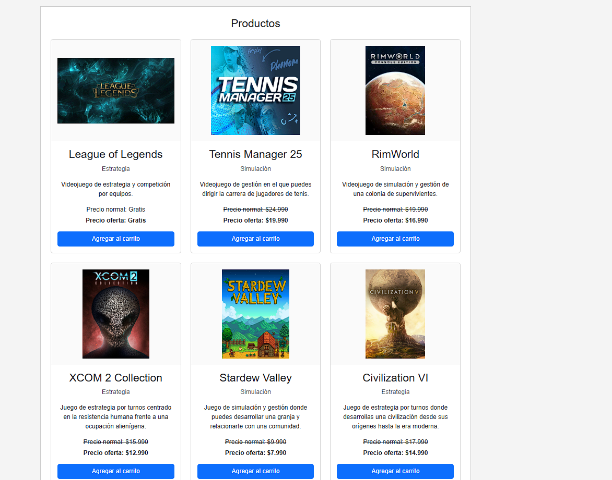
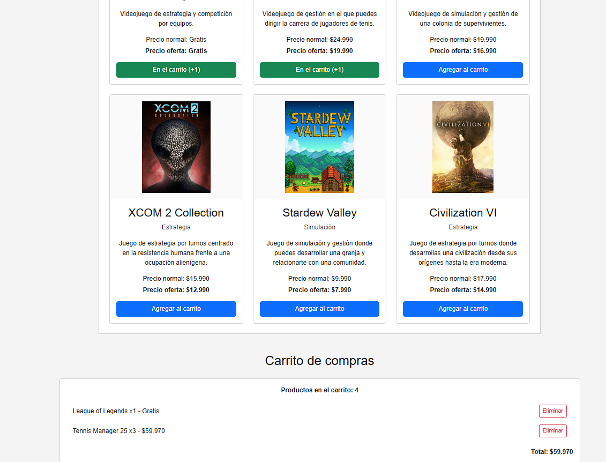
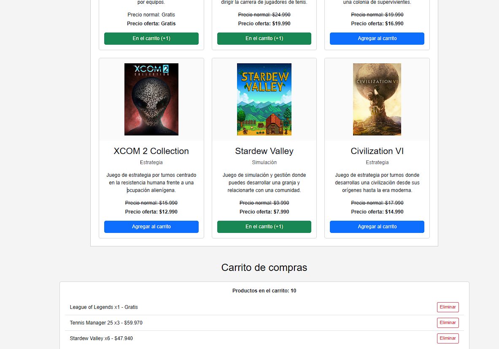
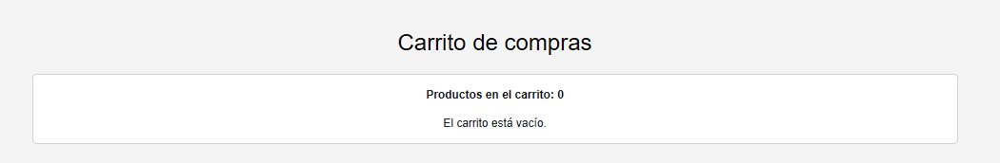
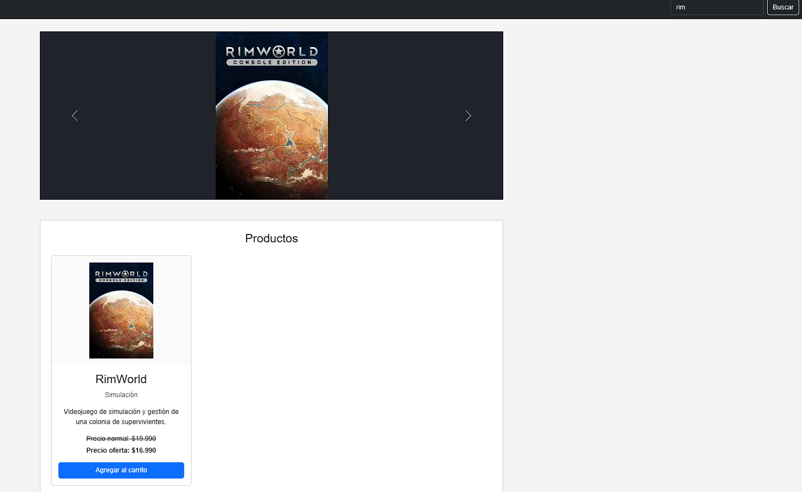
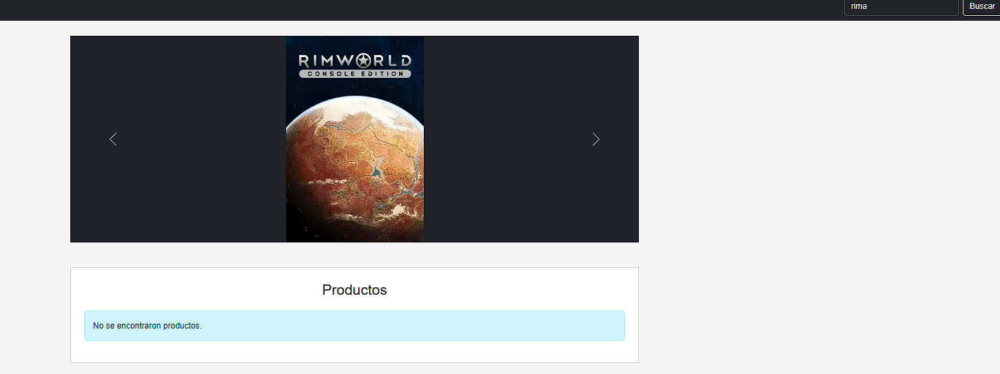
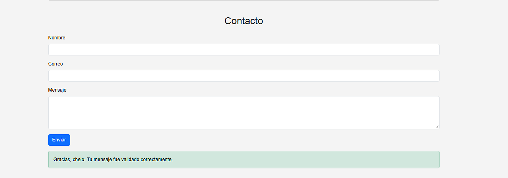

# GameStore

Sitio web responsivo para una tienda de videojuegos desarrollado como actividad de Desarrollo Frontend I.

## Tecnologías utilizadas

- HTML5
- CSS3
- Bootstrap 5
- JavaScript
- Fetch API
- JSON
- React
- Vite

## Aplicación React

La versión actual utiliza componentes funcionales y Hooks (`useState` y `useEffect`) para gestionar el catálogo, los filtros y el carrito de compras.

El catálogo presenta precios normales y de oferta. El carrito permite agregar y eliminar productos, acumular cantidades y calcular automáticamente el total.

### Ejecución local

```bash
npm install
npm run dev
```

Para generar la versión de producción:

```bash
npm run build
```

## Componentes Bootstrap

- Navbar responsiva y colapsable con categorías simuladas
- Formulario de búsqueda integrado en la navegación
- Carousel automático cada 3 segundos
- Sistema Grid responsivo
- Cards para presentar productos

## Interactividad con React

La aplicación utiliza componentes funcionales, props y Hooks (`useState` y `useEffect`).

- Carga del catálogo mediante Fetch API.
- Búsqueda y filtros por categoría.
- Eventos `onClick`, `onChange` y `onSubmit`.
- Carrito con agregar, eliminar, contador y total; los botones del catálogo cambian según si el producto está en el carrito.
- Renderizado condicional para ofertas, carrito vacío y búsquedas sin resultados.
- Validación local del formulario de contacto.

## Fetch API

El catálogo de productos se carga desde:

`public/data/juegos.json`

React utiliza Fetch API para cargar los datos desde JSON y generar las tarjetas mediante componentes reutilizables:

- League of Legends
- Tennis Manager 25
- RimWorld
- XCOM 2 Collection
- Stardew Valley
- Civilization VI

Cada producto incluye nombre, categoría, precio normal, precio de oferta, imagen y descripción.

La carga incluye manejo de errores mediante `try/catch` y comprobación de la respuesta HTTP.

## Organización del proyecto

- `src/App.jsx`: componente principal, estados y eventos.
- `src/main.jsx`: punto de entrada de React.
- `src/components/`: componentes de productos y carrito.
- `src/utils/precios.js`: funciones reutilizables de precios.
- `public/data/juegos.json`: catálogo de productos.
- `public/img/`: imágenes de videojuegos.
- `css/style.css`: estilos personalizados.
- `vite.config.js`: configuración de Vite.

## Sitio publicado

https://Marcelo-Rios21.github.io/HTML/

## Evidencias

### Catálogo de productos


### Carrito de compras


### Renderizado condicional


### Carrito vacío


### Búsqueda de productos


### Búsqueda sin resultados


### Validación del formulario

